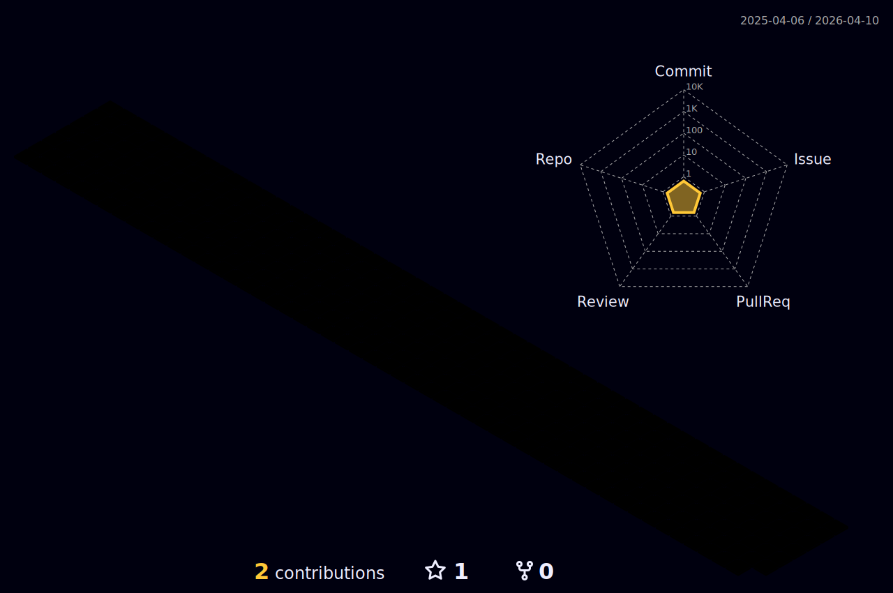

<h1 align='center'>
  Olá, me chamo Charles Braz, 
   
  seja bem vindo!
</h1>

  Desenvolvedor Front-End

### Sobre mim:

  <em>
    Tenho 31 anos, sou de Maringá-PR e estou na reta final do meu curso de desenvolvimento front-end pela kenzie academy.
  </em>

- 🌱 Ultimos aprendizados: TypeScript, teste Unitário / Integração / E2E, desenvolvimento de API.
- 🚀 Estudante da kenzie academy.
- 📫 Meu email: engcivilbraz@hotmail.com.

### Metas 2022:

- 💼 Continuar curso superior em engenharia de software.

- 📈 Adquirir experiência como desenvolvedor e melhorar o inglês.

## 🔧 Technologies & Tools

|     | Stacks | Description |
| --- | --- | --- |
|**Highlighter**|  | HTML, Markdown |
|**Styles**|    | Css, MaterialUI, StyledComponents, ChakraUI |
|**Languages**|  | JavaScript, TypeScript |
|**Frameworks/Libraries**|   | React, Redux, NextJs, nodeJs, Jest |
|**Package Managers**|   | Npm, Yarn |
|**Tools**|     | Git, Github, EsLint, Insomnia |
|**Deploy**|   | Heroku, Vercel |
|**Mockups**|  | Figma |

### Estatísticas:

| Minhas Estatísticas                                                                                                                                                            | Principais Linguagens                                                                                                                                                                     |
| ------------------------------------------------------------------------------------------------------------------------------------------------------------------------ | ---------------------------------------------------------------------------------------------------------------------------------------------------------------------------------- |
|  |  |

| Minhas Contribuições                                                                                                                                                            |
| ------------------------------------------------------------------------------------------------------------------------------------------------------------------------ |
|  |

💬 Quer me conhecer?

  
  
  

 

  <em>
    "Creio firmemente em uma lei de compensação. As verdadeiras recompensas são sempre proporcionais ao esforço e aos sacrifícios feitos"
  </em>

 🧠
  <strong>
    Nikola Tesla
  </strong>

